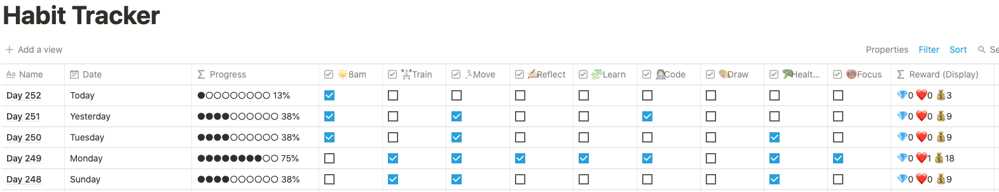

### tl;dr:
> I use Notion, a note-taking app, for daily habit tracking. Using the data I collected of myself, I transformed and visualized it into a dashboard that helps me continue to set better habits and goals and improve my general well-being and quality of life.

# What's Notion? 
I've been using Notion a lot, for the past 4 months or so. I use it for generic to-do lists, keeping track of concepts I learn, ongoing personal projects (like this github page!) and tracking habits. 

It is literally just a note-taking app, but it's just so powerful. I use [this Gamification template](https://www.reddit.com/r/Notion/comments/n81ql6/level_up_gamify_goals_tasks_and_positive_daily/?utm_source=share&utm_medium=web2x&context=3) to reinforce positive behaviours like completing tasks, forming daily habits, and honestly, it's a lot of fun. 

## Habits Tracker
Currently, my Habit Tracker on Notion looks like this:

Each row represents a day - and these are pre-populated for the next couple of years. I use the database's Filter and Sort to have the top-most row as the current day. At midnight, a new row will be added for the new day, with a fresh set of empty checkboxes.

Before I started using the tracker, I defined the habits I wanted to track as the columns. 
* For example, in the 4th column I have a tracker for how often I wake up at or before 8am. 
* I keep a separate note of what each column represents and what *qualifies* as completing that habit for the day. 
* Over time, as I find that I need to make changes to the habits (e.g. I need to start waking up before 7 instead of 8!), I just change the column name and add a remark in a separate column (not shown) to keep track of the date which the change was made. 

The last column tracks the Rewards I get for the number of Habits I get done. There're some slight nuances in the different types of rewards and which habits they're linked to, and I can use these Rewards for a number of items/experiences that I treat myself to for a job well done - but that's also a whole other story. 

# Building the Dashboard
## Baby Steps
I did up some charts after my first month of using this system - and this was done really manually because I wanted to make sure that I *knew* what exactly I wanted to do before I jumped straight into automating it. 
1. I exported the data from Notion to csv and saved that to Google Sheets
2. I made a pivot table to summarize the data by week.
3. I made a couple of charts: habits completion for the entire month, completion of each habit per week, etc. 

## How I used the charts
Based on which habits I was rockin' and which I was just miserable at, I made some adjustments: 
    - I replaced "cook" with "healthy eating", because it wasn't practical to cook everyday (and sometimes I meal prep instead).
    - For habits I was consistent in, I tried to strech myself by making the criteria to achieve them more stringent. For example, rambling on a journal entry about the events of the day was too easy, so I renamed it to "Reflecting" instead to encourage more depth of thought in my entries. 

## Automate the Boring Stuff
No way I'm repeating all those steps every month if I can just make macneto (my macbook) do it for me. 

To automate the process, first I needed to learn how to use Notion's API (which was also released pretty recently). Using `cURL` isn't exactly something I'm used to, but I managed to *finally* bypass the various Authorization processes to get my data through Python. *Hot tip: use Notion's Integration Token to set up a 'backdoor' for your Python script.*

After getting the data, I processed it a little with `pandas`, put it into some `plotly` charts, and pieced those together on a web app using `streamlit`. It's my first time using Streamlit, and I am amazed. It's so easy to use, it works so well, and it's incredibly smart. 

The code is all available on [my github repo](https://github.com/gerpang/NotionHabitsViz).

## More! 
There was actually a whole lot more I wanted to do, but first I thought it would be good to get out an MVP, and this is really it. 

### Charts
I actually really dislike how the last chart looks. I know you can interact with it to make it more readable, but I still think it looks like a hot mess of colourful noodles now. 

I also think my habits can be further categorised, so maybe I'll split that last chart into 3 subplots so it becomes much easier to view at a glance. 

### Side bar!
I wanted to add in functions to filter the charts by a specific date period or month.